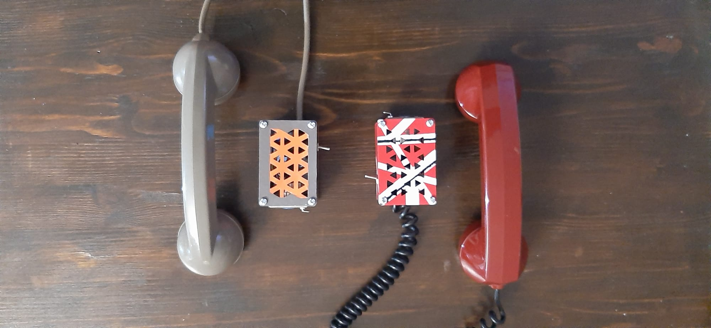
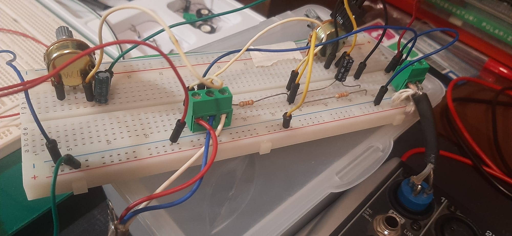

# Phone Handset RC Filter

*I apologise profusely for the inability to make a simple, simmetric photo*
<br></br>

This project is mainly inspired by the works of [Ryan Mobitz](https://www.production-expert.com/production-expert-1/use-an-old-phone-handset-to-produce-a-lo-fi-mic) and [Noisegate](https://noisegate.com.au/how-to-create-a-stereo-microphone-from-an-old-telephone-handset/).

The main contribution of this project is treating the telephone handset as a separate module from the main circuit, which is designed as an independent audio effect stage.

Another major difference is the use of an external power supply. This allows the use of a carbon microphone even without a mixer providing phantom power.  
Thanks to the lower supply voltage (9V instead of the standard 48V phantom power), there is no need for an impedance-matching transformer, significantly reducing manufacturing costs and complexity.

``` Python
The project contains:
    ./imgs/ # All the figures used in the README
    ./schema_and_pcb/ #This contains the main source files
        |
        |-> ./out/ #Files for JLC PCB
        |
        |-> ... # All the kicad files
        |
        |-> ./Case.zip/ #Contains al the .stl for the enclosure
```

## Overview

The circuit is a simple RC-based filter and conditioning stage designed to work with vintage telephone handsets, supporting both the dynamic capsule and the carbon microphone.

The reference in the schematic is an headset from an italian Siemens S62 (aka Bigrigio):

- **Dynamic capsule (≈55 Ω)**
- **Carbon microphone (≈100 kΩ)**

A switch allows selecting the appropriate signal path depending on the capsule type.

The output is provided via a standard **XLR3 panel connector**, making the device compatible with mixers, audio interfaces, and recording systems.

Power is supplied externally through a **9V DC input (center negative)**, the standard de facto for effects.

---

## Electrical Schematic
<center>
    
</center>
<br></br>

Both the schematic and the PCB were designed using **KiCad**.

The circuit can be divided into four main sections:


### 1. Input Section (Handset Connector)
The handset is connected via a 3-pin terminal block:

- Pin 1: Carbon Microphone
- Pin 2: Dynamic Capsule
- Pin 3: Common Ground

<center>
    
</center>

<br></br>

#### Dynamic Capsule Characteristics

- Very low impedance (~55 Ω)
- Does **not** require bias voltage
- Generates signal directly from diaphragm movement

#### Carbon Microphone Characteristics

- High impedance (~100 kΩ)
- Requires **DC bias current**
- Output is a resistance variation modulating the bias voltage
- Produces strong midrange distortion (classic telephone sound)

Because the two technologies behave completely differently, they require different conditioning paths.


### 2. RC Filter Network
The **R1 (33kΩ)** provides **bias current limiting** for the carbon microphone when in carbon mode. R1:
- Limits current from the 9V supply
- Sets operating point of the carbon capsule
- Prevents excessive noise and overheating

Typical carbon microphones work best with a few milliamps of current.  
33kΩ at 9V provides a safe, low-current bias suitable for vintage elements.

The pair **R2 (33kΩ), C2(10µF)** forms a **high-pass RC filter**.

This network shapes the frequency response, emphasizing the lo-fi telephone character by limiting bandwidth and controlling gain.
The **R3 (50kΩ on the schematic, a 47kΩ was actually used)** resistor acts as a level control.

<center>
    
</center>
<br></br>

**R4 (10kΩ) and C1 (1µF)** work in a similiar fashon, acting as a filter for the dynamic capsule.

This contributes slightly to the “telephone effect”, although the main bandwidth limitation comes from the capsule itself.


### 3. Power and Output Stage

- **9V DC input (center negative)**
- **LED + 750Ω resistor** for power indication
- **XLR3 output connector**

The XLR pinout follows the standard convention:

- Pin 1: Signal -
- Pin 2: Signal +


A **DPDT push switch** allows selecting the correct configuration depending on the capsule type:

- Dynamic mode
- Carbon mode (powered)

This isolates the microphone from the power section when not needed.

<center>
    
</center>
<br></br>

> Note:  
> This is **not a fully balanced active output**.  
> It is pseudo-balanced/passive and works well for short cable runs.
>
> For professional long runs, an active balanced driver could be added.

---

## PCB



The PCB was designed in KiCad with through-hole components for easy assembly and repair.

Design goals:

- Compact footprint
- Simple routing
- Clear separation between power and signal paths
- Easy integration into a custom enclosure

In order to connect both the DPDT and the XLR i used a **JST** standard 2mm terminal

<center>
    
</center>

---

## Enclosure

The enclosure was designed in CAD (Onshape) and consists of:

- Base plate
- Main body
- Top plate

The layout ensures mechanical stability and easy access to all connectors.

<center>
    
</center>

<center>
    
</center>

<center>
    
</center>

<center>
    
</center>

---

## Future Improvements and Considerations

This project started as an experiment and as a way to understand better how simple analog circuits behave in the real world.

It was the first time I designed a complete audio stage from scratch and along the way I definitely made a few mistakes. For example, the value of the **R3 resistor** was tuned empirically after testing with a potentiometer, and only later replaced with the closest fixed value I had available. In hindsight, using a 100kΩ trimmer from the beginning would have made the tuning process much cleaner and more flexible.

I also chose a female XLR panel connector, which is not the standard choice for this kind of device. A male XLR would have been more appropriate, but I worked with what I could source locally at the time.

Despite these imperfections, the device works reliably and captures exactly the grittyness telephone sound.